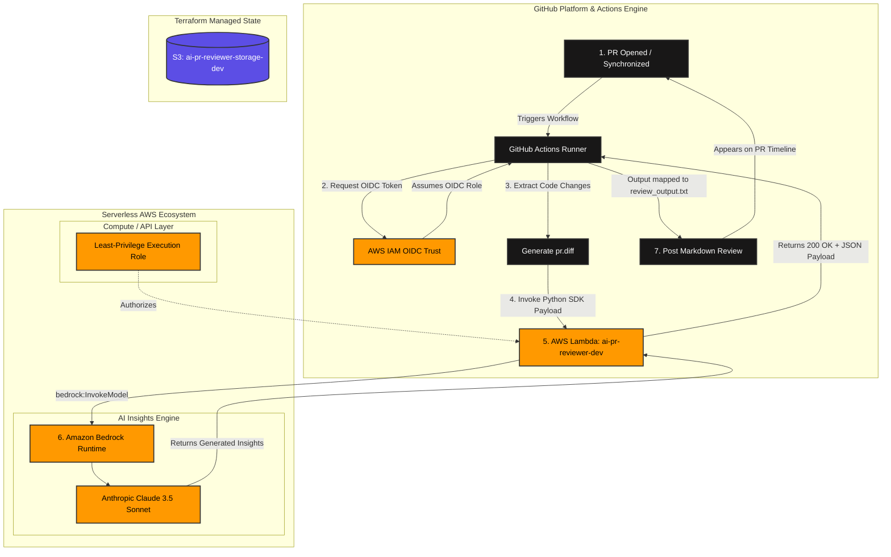

# Automated AI Code Reviewer Pipeline

An event-driven GitOps and DataOps system that automatically reviews Pull Requests for security flaws, performance enhancements, and style optimizations. It uses a serverless AWS Lambda backend combined with Amazon Bedrock (Anthropic Claude 3.5 Sonnet) to post real-time code reviews directly back into your GitHub Pull Request comments.

## 🏗️ System & Workflow Architecture

The entire infrastructure is declared as code using Terraform, utilizing an event-driven automation loop triggered completely by repository pull request updates.



---

## 🛠️ Technical Highlights & Pipeline Guardrails

* **Remote State and Encryption:** Configured with a dedicated remote Amazon S3 state storage backend tracking pipeline drift with native server-side encryption.
* **Secure OIDC Auth Federation:** Bypasses static, high-risk, long-lived AWS Access Keys. The GitHub Actions worker dynamically authenticates using OpenID Connect (OIDC) security tokens to assume a temporary IAM Execution role in AWS.
* **Strict Minimal Attack Surface:** Bypasses loose administrative wildcard privileges. The dedicated Lambda Execution role holds single-purpose attachments strictly mapping out `bedrock:InvokeModel` permissions.
* **Streamlined Context Analysis:** Uses a modularized standalone Python handler package compiling source file diff payloads directly into a structured Anthropic-native payload framework.

---

## 📂 Repository Directory Structure

```text
├── .github/
│   └── workflows/
│       └── review.yml          # GitHub Actions CI/CD automation workflow
├── modules/
│   └── pr_reviewer/
│       └── src/
│           └── lambda_function.py # Python Lambda handler translating diffs to Bedrock
├── backend.tf                  # Declares S3 remote state tracking settings
└── main.tf                     # Core configurations for Lambda, URLs, and IAM Policies
```

---

## 🚀 Getting Started

### 1. Configure the AWS Backend & Secrets
Ensure your target S3 bucket for the state tracking exists, and attach your GitHub Actions Runner OpenID Connect (OIDC) ARN mapping into the environment configurations.

### 2. Infrastructure Initialization & Deployment
Run the following standard execution blocks inside the workspace root:

```bash
# Initialize and sync remote state plugins
terraform init

# Validate configuration text syntax 
terraform validate

# Provision your AWS Lambda infrastructure resources
terraform apply
```

### 3. CI/CD Activation
Once deployed, simply commit code or open a **Pull Request** on this repository. The `.github/workflows/review.yml` action will immediately fire, run the Git differences, invoke your cloud instance, and write the analysis markdown report right onto your active workspace pull request line automatically.


